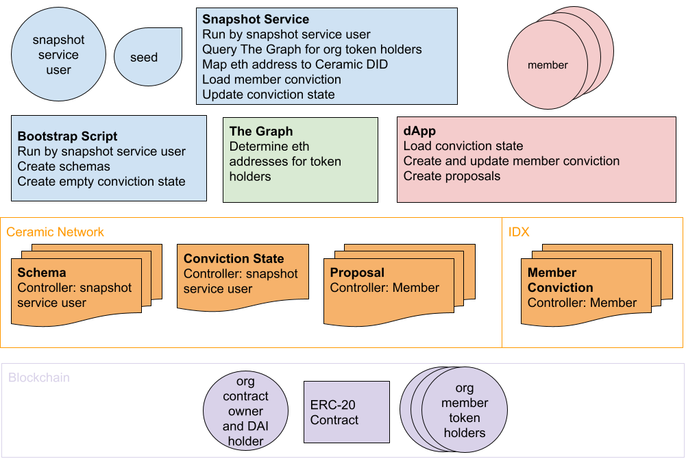
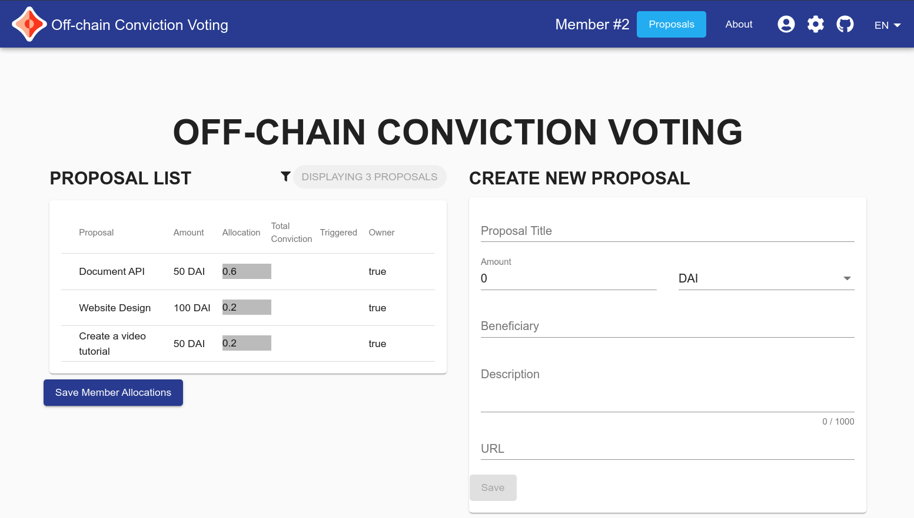

# Off-chain Conviction Voting

Submission to GitCion GR9 Hackathon

An off-chain implementation of Conviction Voting where organization members can vote on proposals by allocating a percentage of their tokens to the proposal. Conviction is calculated with a snapshot service that runs regularly. Instead of staking tokens, it is implemented using off-chain, verifiable data structures managed by Ceramic and IDX.

## Related repositories:
contract:
https://github.com/dynamiculture/offchain-cv-contract

snapshot service:
https://github.com/dynamiculture/offchain-cv-snapshot

## Diagram


## Screenshot


## Technologies
- [Ceramic HTTP Client](https://developers.ceramic.network/reference/javascript/clients/#http-client): Provides access to the Ceramic Network via a remote node running Ceramic.
- [3ID Connect](https://developers.ceramic.network/build/authentication/#did-provider-or-wallet): Provides authentication to a DID (used by Ceramic) from a blockchain wallet, and stores a link from this blockchain account to your DID in IDX.
- [IDX](https://idx.xyz/): Provides a way to create identity records for a DID. Records are stored on Ceramic and can represent links to blockchain accounts or other user data.
- [Angular](https://angular.io/): Web application framework.
- [NgRx](https://ngrx.io/): Reactive state management.


## Run Dev Server with Ceramic's Clay Testnet Network
Uses Ceramic's Clay testnet network to store Ceramic and IDX documents. Clone project and run: 
```
cd offchain-cv-dapp
npm i
ng serve
```
Navigate to `http://localhost:4200/`. The app will automatically reload if you change any of the source files.

## Run Dev Server on local Ceramic Network

Clone project and install packages: 
```
cd offchain-cv-dapp
npm i
```

Run `npm run ceramic` for the local ceramic server.

Switch to local Ceramic Network by updating path in `bootstrap.js` and `ceramic-token.ts` to:
```
const CERAMIC_URL = 'http://localhost:7007'
```

### Create Ceramic Schema and Definition
run to create seed for IDX identity:
```
node -e "console.log(require('crypto').randomBytes(32).toString('hex'))"
```
run:
```
SEED=<your seed from above> npm run bootstrap
```

### Test setting IDX user convictions
from config.json get definitions->convictions definitionID
```
idx index:set local <definitionID from above> '{"context":"blank", "proposals":[], "convictions":[]}'
```

## Build dapp

Run `ng build` to build the project. The build artifacts will be stored in the `dist/` directory. Use the `--prod` flag for a production build.


## References
- Trust minimized, off-chain conviction voting: https://blog.ceramic.network/trust-minimized-off-chain-conviction-voting/
- Ceramic Documentation: https://developers.ceramic.network/build/writes/
- IDX Documentation: https://developers.idx.xyz/build/writing/
- IDX Sample App: https://github.com/ceramicstudio/idx-demo-app and blog post https://blog.ceramic.network/how-to-build-a-simple-notes-app-with-idx/
- Ceramic Web Playground https://ceramicstudio.github.io/web-playground/


